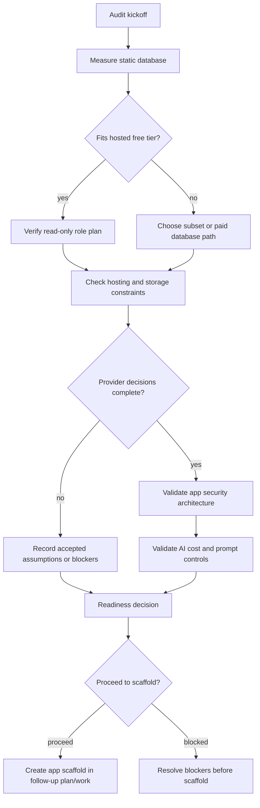

# chore: Establish pre-scaffold audit gate

## Summary

This plan defines the audit package that must be completed before the Summer Intern Portal app is scaffolded. It turns the current planning docs into a go/no-go gate covering database fit, hosting terms, artifact storage, secret handling, read-only SQL safety, AI cost controls, and deployment readiness.

---

## Problem Frame

The repository is still planning-only, and `AGENTS.md` says to read the requirements, stack research, and security model, then check whether the static database fits Neon Free before creating the application scaffold. The product scope is security-sensitive because it combines fixed-user authentication, controlled de-identified research data, SQL execution, server-side Foundry/Azure access, artifact publishing, and per-intern usage tracking.

The audit gate prevents app scaffolding from hard-coding assumptions that are still unresolved: actual static database size, whether Vercel Hobby is acceptable beyond prototype use, which Foundry/Azure models and prices are available, artifact storage limits, and export limits.

---

## Requirements

**Audit scope**

- R1. The audit must decide whether the static teaching database fits the free-tier hosted Postgres target before app scaffolding begins.
- R2. The audit must preserve the origin requirement that Foundry/Azure keys, database URLs, passwords, and storage tokens remain server-side only.
- R3. The audit must verify that intern-facing query execution will have both database-role and app-level read-only controls.
- R4. The audit must choose or defer the artifact storage provider using expected artifact count, size, visibility, and provider limits.
- R5. The audit must capture model availability, token pricing configuration, and budget guardrails without hard-coding current prices into application code.
- R6. The audit must produce a clear scaffold readiness decision: proceed, proceed with accepted assumptions, or block.
- R7. The audit must decide how published HTML artifacts are isolated or served so intern-uploaded HTML cannot execute with portal privileges.

**Traceability**

- R8. The audit must trace each gate back to `docs/brainstorms/summer-intern-portal-requirements.md`, `docs/architecture/free-tier-tech-stack-research.md`, `docs/security/security-model.md`, or the current external source that shaped the gate.
- R9. The audit must update existing planning docs only where an audited fact supersedes a stale assumption or fills an open question.

**Implementation discipline**

- R10. The audit plan must not create the Next.js scaffold, migrations, API routes, or product UI.
- R11. Any helper script added for the audit must read secrets from the environment and must not print full connection strings, API keys, raw query results, or private artifact contents.

---

## Key Technical Decisions

- KTD1. Pre-scaffold audit first: The first executable work should be a readiness gate, not the app scaffold, because the repo instruction explicitly requires the database-fit check before implementation and several provider decisions remain unsettled.
- KTD2. Evidence artifact over checklist-only completion: The audit should produce a dated evidence report, not just checked boxes, so the eventual implementer can see measured database size, chosen provider constraints, and accepted assumptions.
- KTD3. Keep storage provider selection conditional: Vercel Blob, Supabase Storage, and Azure Blob remain viable until expected HTML artifact sizes and deployment plan are known. The audit should choose only if the evidence is enough.
- KTD4. Use provider limits as gates, not permanent architecture constants: Neon, Vercel, Supabase, and Azure pricing/limits are drift-prone. The audit should record the checked date and source, while implementation should keep prices and limits configurable.
- KTD5. Separate metadata writes from intern query previews: The future app should use an app metadata connection for auth/recipes/logging and a separate read-only connection for teaching-data previews, matching `docs/security/security-model.md`.
- KTD6. Treat AI and SQL paths as public endpoints: Next.js official guidance says Route Handlers and Server Actions require authorization checks at the data boundary. The future audit should require server-side session checks for AI, preview, recipe, artifact, and admin flows.

---

## High-Level Technical Design

The audit lifecycle has two hard gates: database fit and scaffold readiness. Storage and hosting decisions can either be resolved or carried as accepted assumptions, but app scaffolding should not begin while a blocker remains unresolved.

---

## Implementation Units

### U1. Create Audit Evidence Package

- **Goal:** Define the durable audit report and checklist shape used by the rest of the gate.
- **Requirements:** R6, R8, R9, R10
- **Dependencies:** None
- **Files:** `docs/audits/2026-06-24-pre-scaffold-audit.md`, `docs/audits/pre-scaffold-audit-checklist.md`
- **Approach:** Create a dated evidence report with sections for database fit, provider constraints, security controls, AI cost controls, artifact storage, blockers, accepted assumptions, and scaffold readiness. Keep the reusable checklist separate so future refreshes do not overwrite dated evidence.
- **Patterns to follow:** `docs/planning/mvp-plan.md` for phase-gate structure; `docs/runbooks/deployment.md` for deployment checklist style.
- **Test scenarios:** Test expectation: none -- documentation-only audit scaffold with no executable behavior.
- **Verification:** A reviewer can map every audit checklist item to one evidence section and one source document or external source.

### U2. Audit Static Database Fit and Read-Only Role

- **Goal:** Determine whether the static teaching copy can use Neon Free and whether the read-only role design is sufficient before scaffolding.
- **Requirements:** R1, R3, R8, R11
- **Dependencies:** U1
- **Files:** `docs/audits/2026-06-24-pre-scaffold-audit.md`, `docs/runbooks/data-migration.md`
- **Approach:** Use the existing data migration runbook as the measurement protocol. Record source database size, largest tables, estimated loaded hosted size, index impact, and whether a subset or paid database is required. Verify the planned reader role has only connection, schema usage, and select privileges on approved schemas.
- **Patterns to follow:** `docs/runbooks/data-migration.md` for measurement and role-verification sequence; `docs/security/security-model.md` for the two-connection model.
- **Test scenarios:**
  - Happy path: Given measured database size within the free-tier threshold, the audit records Neon Free as viable with the measured size and source date.
  - Edge case: Given measured database size near the threshold, the audit marks Neon Free as conditional and records index/subset follow-up before scaffold.
  - Failure path: Given measured database size over the threshold, the audit blocks free-tier Neon scaffolding and records a curated subset or paid Postgres decision.
  - Permission path: Given a read-only role verification attempt, write-class SQL fails while `SELECT` succeeds, and the audit records the result without raw row payloads.
- **Verification:** The audit report contains a database-fit decision and read-only-role evidence, or lists them as blockers that prevent scaffolding.

### U3. Audit Hosting, Storage, and Provider Limits

- **Goal:** Refresh drift-prone provider constraints that affect the architecture before app code bakes them in.
- **Requirements:** R4, R6, R8, R9
- **Dependencies:** U1
- **Files:** `docs/audits/2026-06-24-pre-scaffold-audit.md`, `docs/architecture/free-tier-tech-stack-research.md`, `docs/runbooks/deployment.md`
- **Approach:** Record current checked constraints for Neon Free, Vercel Hobby/Pro, Vercel Blob, Supabase Storage, and Azure Blob if Azure is considered. Treat Vercel Hobby as prototype-only unless an institutional review explicitly accepts it for deployment.
- **Patterns to follow:** `docs/architecture/free-tier-tech-stack-research.md` for provider comparison; `docs/runbooks/deployment.md` for deployment posture.
- **Test scenarios:**
  - Happy path: Given the app is only a prototype, the audit allows Vercel Hobby while clearly marking it prototype-only.
  - Deployment path: Given planned institutional intern use, the audit requires Vercel Pro or a documented approval for Hobby.
  - Storage path: Given expected HTML artifact sizes within a free-tier provider limit, the audit records the chosen provider and visibility model.
  - Failure path: Given expected artifacts exceed free-tier storage or upload limits, the audit defers scaffold or selects a paid/alternate storage path.
- **Verification:** The audit report has a provider decision table with checked dates, source URLs, decision status, and any required follow-up.

### U4. Audit App Security Architecture

- **Goal:** Confirm the future scaffold has enough security decisions to implement auth, authorization, SQL validation, and logging without exposing controlled data.
- **Requirements:** R2, R3, R8, R10, R11
- **Dependencies:** U1, U2
- **Files:** `docs/audits/2026-06-24-pre-scaffold-audit.md`, `docs/security/security-model.md`, `.env.example`
- **Approach:** Validate the security model against the origin requirements and current Next.js guidance: server-only secrets, hashed passwords, secure cookies, data-access authorization checks, single-statement `SELECT` validation, preview limits, timeouts, and metadata-only logging.
- **Patterns to follow:** `docs/security/security-model.md` for threats and mitigations; `docs/architecture/system-architecture.md` for server-side API route boundaries; `.env.example` for expected secret names.
- **Test scenarios:**
  - Secret path: Given each required secret in `.env.example`, the audit classifies it as server-only or public and flags any public prefix on sensitive values as blocking.
  - Auth path: Given six intern accounts and one admin account, the audit confirms password hashes are required and plaintext seed values are out of scope.
  - Password-rotation path: Given an admin needs to rotate an intern password, the audit confirms the future scaffold has a server-side hash replacement workflow or records rotation as a scaffold blocker.
  - SQL safety path: Given a proposed preview endpoint, the audit requires app-level single-`SELECT` validation even though the database role is read-only.
  - Logging path: Given a query preview, the audit allows SQL text and metadata logging but blocks full raw result logging by default.
- **Verification:** Security blockers are either resolved in the audit report or carried as explicit scaffold-blocking items.

### U5. Audit AI Proxy, Prompt, and Cost Controls

- **Goal:** Confirm the Foundry/Azure model access pattern and budget controls before implementing AI routes.
- **Requirements:** R2, R5, R8, R11
- **Dependencies:** U1, U4
- **Files:** `docs/audits/2026-06-24-pre-scaffold-audit.md`, `docs/planning/token-cost-control.md`, `.env.example`
- **Approach:** Record available Foundry/Azure deployments, endpoint shape, API version, selected cheap/default/code/strong/premium model roles, and configurable per-token pricing. Require prompt inputs to use schema summaries and approved samples, not full row-level extracts.
- **Patterns to follow:** `docs/architecture/free-tier-tech-stack-research.md` for model-routing policy; `docs/security/security-model.md` for prompt and logging policy.
- **Test scenarios:**
  - Happy path: Given confirmed Foundry/Azure deployments and prices, the audit records model routing and cost-estimation inputs without code-level price constants.
  - Missing-price path: Given unavailable model pricing, the audit blocks cost-dashboard implementation or records a temporary admin-configured estimate as an accepted assumption.
  - Prompt-safety path: Given a dataset-building request, the audit requires schema context and small approved samples only, not full query results.
  - Budget path: Given per-user budget settings, the audit confirms daily and monthly limits have an owner and default values before scaffold.
- **Verification:** The audit report identifies model deployments, cost configuration status, and any unresolved Foundry/Azure blockers.

### U6. Audit Artifact Publication and Visibility

- **Goal:** Confirm the artifact workflow can support private drafts, cohort sharing, and admin visibility without leaking private work.
- **Requirements:** R4, R6, R7, R8, R11
- **Dependencies:** U1, U3, U4
- **Files:** `docs/audits/2026-06-24-pre-scaffold-audit.md`, `docs/security/security-model.md`, `docs/runbooks/deployment.md`
- **Approach:** Evaluate storage providers against expected HTML artifact sizes, private draft access, shared final gallery access, admin visibility, upload limits, serving isolation, and rollback posture. Keep full artifact-content scanning out of MVP unless explicitly chosen later.
- **Patterns to follow:** `docs/brainstorms/summer-intern-portal-requirements.md` for visibility model; `docs/security/security-model.md` for artifact leak mitigation.
- **Test scenarios:**
  - Draft path: Given an uploaded HTML artifact, the audit requires draft/private visibility by default.
  - Publish path: Given an intern publishes a final artifact, the audit requires cohort visibility and admin visibility.
  - Permission path: Given another intern views the gallery, the audit requires private drafts from other interns to remain hidden.
  - HTML isolation path: Given an uploaded HTML artifact contains script tags, the audit requires a serving model that prevents the artifact from running with portal session privileges.
  - Rollback path: Given an artifact privacy issue, the audit requires a documented way to disable sharing or mark artifacts private.
- **Verification:** The audit report either selects an artifact provider or records storage selection as a scaffold blocker/accepted assumption with explicit limits.

### U7. Produce Scaffold Readiness Decision and Update Planning Docs

- **Goal:** Close the audit with a clear decision and update the planning docs with verified facts.
- **Requirements:** R6, R8, R9, R10
- **Dependencies:** U2, U3, U4, U5, U6
- **Files:** `docs/audits/2026-06-24-pre-scaffold-audit.md`, `docs/planning/mvp-plan.md`, `docs/architecture/free-tier-tech-stack-research.md`, `docs/runbooks/deployment.md`
- **Approach:** Write a readiness decision with one of three outcomes: proceed to scaffold, proceed with accepted assumptions, or block. Update existing docs only where the audit replaces stale assumptions or closes an open question.
- **Patterns to follow:** `docs/planning/mvp-plan.md` for checked/unchecked gate language; `README.md` for concise project direction.
- **Test scenarios:**
  - Proceed path: Given all hard gates are satisfied, the audit marks scaffold ready and identifies which follow-up plan should create the app.
  - Accepted-assumption path: Given a non-blocking unknown such as final artifact provider, the audit records the assumption, owner, and condition that must be revisited.
  - Blocked path: Given a hard blocker such as oversized database or unknown model pricing, the audit marks scaffolding blocked and names the smallest next decision needed.
  - Doc-update path: Given a verified provider limit that differs from an existing doc, the updated doc records the current source and checked date.
- **Verification:** The final audit decision is unambiguous, and no Next.js scaffold or product code is created by this plan.

---

## Scope Boundaries

### In Scope

- Measuring and recording static database fit for the hosted Postgres target.
- Verifying the read-only query role strategy before intern-facing query execution exists.
- Refreshing current provider constraints that affect the scaffold decision.
- Auditing server-side secret, auth, SQL safety, AI prompt, token usage, artifact, and logging assumptions.
- Updating planning docs when audited facts replace open questions or stale assumptions.

### Deferred to Follow-Up Work

- Creating the Next.js/TypeScript application scaffold.
- Implementing authentication, dataset builder UI, AI proxy routes, query preview routes, recipe persistence, artifact uploads, or admin dashboards.
- Creating database migrations for app metadata.
- Writing production monitoring, deployment automation, or CI beyond audit support.
- Building cloud Python/R execution.

### Outside This Product's Identity

- Public signup.
- Direct access to the source institutional database.
- Browser-based arbitrary code execution for interns.
- Claims of production HIPAA/SOC2 compliance for MVP.

---

## System-Wide Impact

The audit gate affects every future implementation surface because it decides whether the first scaffold targets free-tier Neon, paid/alternate Postgres, Vercel Hobby, Vercel Pro, and a specific artifact storage provider. It also fixes the minimum security posture for all future API routes: server-side secrets, per-user accountability, admin authorization, read-only preview execution, budget checks, and metadata-only logging.

---

## Risks & Dependencies

- **Database-size dependency:** The plan cannot declare Neon Free viable until the static copy is measured after import/index decisions.
- **Source-access dependency:** The database-fit audit is blocked if the team cannot access the source static database or a representative dump with permission to measure size.
- **Provider-limit drift:** Pricing and free-tier limits can change. The audit must record checked dates and source URLs.
- **Institutional deployment terms:** Vercel Hobby remains prototype-only unless an appropriate review approves it for the internship deployment.
- **Model pricing uncertainty:** Azure Foundry prices vary by model, region, agreement, and deployment type; hard-coded estimates would make the cost dashboard misleading.
- **Security false confidence:** A read-only database role does not replace app-level SQL parsing, row limits, timeouts, and authorization checks.
- **Uploaded HTML execution:** Intern-uploaded HTML must not execute in the same trust context as the authenticated portal unless the audit explicitly accepts and mitigates that risk.

---

## Acceptance Examples

- AE1. Given the measured static database exceeds Neon Free storage, when the audit closes, then scaffold readiness is blocked or redirected to a curated subset or paid database plan.
- AE2. Given the measured static database fits Neon Free and read-only-role verification passes, when the audit closes, then database hosting can proceed as an approved scaffold assumption.
- AE3. Given Vercel Hobby is proposed for actual intern deployment, when the audit closes, then the plan records either an institutional approval or a requirement to use Pro/another hosting posture.
- AE4. Given Foundry/Azure pricing is not confirmed, when the audit closes, then cost dashboard implementation is blocked or uses an explicitly accepted temporary estimate.
- AE5. Given artifact sizes are unknown, when the audit closes, then artifact storage remains a named blocker or accepted assumption rather than an implicit provider commitment.
- AE6. Given a published HTML artifact includes active scripts, when the audit closes, then the serving model prevents those scripts from accessing portal cookies or privileged APIs.

---

## Documentation / Operational Notes

- Keep the audit report in `docs/audits/` so future implementation plans can cite the actual readiness decision rather than re-reading every planning document.
- Do not commit database dumps, CSV extracts, Parquet files, screenshots containing data, or env files during the audit.
- If any provider limit changes from the existing research docs, update the affected document with the checked date and source.
- If the audit proceeds with accepted assumptions, make those assumptions visible in the follow-up scaffold plan.

---

## Sources & Research

- `docs/brainstorms/summer-intern-portal-requirements.md` defines the product scope, actors, workflow, safety requirements, success criteria, and open questions.
- `docs/architecture/free-tier-tech-stack-research.md` recommends Next.js/Vercel, Neon if the database fits, server-side Foundry/Azure, and configurable token pricing.
- `docs/security/security-model.md` defines the threat model, two-connection database design, SQL safety policy, prompt policy, and logging policy.
- `docs/runbooks/data-migration.md` defines database measurement, export, restore, read-only role, and schema-summary steps.
- `docs/runbooks/deployment.md` defines deployment env vars, preflight checklist, smoke test outline, and rollback posture.
- `docs/planning/token-cost-control.md` defines token logging fields, configurable cost formula, conservative initial budgets, model routing, and kill switches.
- [Next.js authentication docs](https://nextjs.org/docs/app/guides/authentication#how-to-implement-authentication-in-next-js), checked 2026-06-24 with Ref, recommend treating auth as authentication, session management, and authorization; they also recommend server-side validation, secure HTTP-only cookies, data-access-layer authorization, and route-handler authorization.
- [Next.js environment-variable docs](https://github.com/vercel/next.js/blob/canary/docs/01-app/02-guides/environment-variables.mdx?plain=1#L194#runtime-environment-variables), checked 2026-06-24 with Ref, state that environment variables are server-only by default and browser exposure requires the `NEXT_PUBLIC_` prefix.
- [Next.js Route Handler docs](https://nextjs.org/docs/app/api-reference/file-conventions/route#route-js), checked 2026-06-24 with Ref, confirm route handlers support request methods and should handle cookies, request bodies, and route config on the server side.
- [node-postgres query docs](https://github.com/brianc/node-postgres/blob/master/docs/pages/features/queries.mdx?plain=1#L16#parameterized-query), checked 2026-06-24 with Ref, recommend parameterized queries and warn that identifiers cannot be parameterized.
- [Drizzle getting-started docs](https://orm.drizzle.team/docs/get-started/vercel-new), checked 2026-06-24 with Ref, show TypeScript schema/migration structure suitable for app metadata, while raw controlled preview queries should remain separate.
- [Neon plan docs](https://neon.tech/docs/introduction/plans), checked 2026-06-24 with Tavily, report Free plan storage at 0.5 GB per project and 100 CU-hours per project.
- [Vercel Hobby docs](https://vercel.com/docs/plans/hobby), checked 2026-06-24 with Tavily, describe Hobby as non-commercial/personal use and position Pro for more resources and team/professional usage.
- [Vercel Blob pricing docs](https://vercel.com/docs/vercel-blob/usage-and-pricing), checked 2026-06-24 with Tavily, show Blob availability on all plans with Hobby usage limits and rate limits.
- [Supabase pricing](https://supabase.com/pricing), checked 2026-06-24 with Tavily, shows a free plan with project/storage constraints that may be useful if bundled storage/auth tradeoffs outweigh Neon simplicity.
- [Azure Foundry pricing docs](https://azure.microsoft.com/en-us/pricing/details/ai-foundry-models/aoai), checked 2026-06-24 with Tavily, emphasize that actual model pricing varies by agreement, date, currency, model, region, and deployment type.
