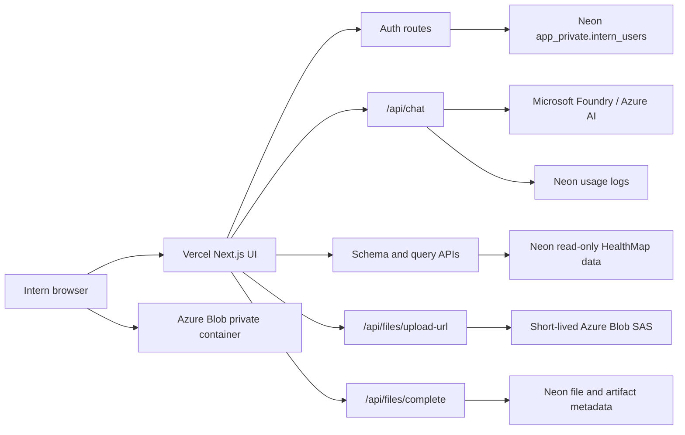

# Azure Blob storage and auth deployment plan

## Summary

Plan the production-ready path for the Equity RQ / HealthMap intern chat portal:
Neon hosts the static map dataset and app metadata, Foundry powers chat through
server-side routes, Vercel hosts the frontend, and Azure Blob stores uploads and
artifacts under per-user prefixes.

The recommended auth path is to keep the current custom credentials auth for MVP:
fixed users seeded by admin, bcrypt password hashes in Neon, signed HTTP-only
session cookies, no public signup, and `AUTH_ALLOW_ENV_FALLBACK=false` in
deployment. Auth.js should be deferred until the team needs SSO, MFA, password
reset emails, or provider-based login.

## Requirements

R1. Fixed-user auth

- Support predefined intern and admin accounts only.
- Store password hashes only in `app_private.intern_users`.
- Use signed HTTP-only cookies for sessions.
- Revalidate active users against Neon before protected API access.
- Disable env-user fallback in deployed environments.

R2. Neon data roles

- Use `DATABASE_URL` only for app metadata, user records, usage logs, and file
  metadata.
- Use `READONLY_DATABASE_URL` for HealthMap schema browsing and read-only query
  previews.
- Keep app-level SQL validation even when the database role is read-only.

R3. Foundry chat

- Keep Foundry/Azure API keys server-side only.
- Route model calls through `/api/chat`.
- Keep model routing and budget checks server-side.
- Send schema, metadata, summaries, and masked examples by default.
- Send PHI only when it is necessary to produce correct code for an approved
  task.

R4. Azure Blob uploads

- Store upload bytes in a private Azure Blob container.
- Use one generated blob path per upload under the signed-in user prefix.
- Issue short-lived SAS URLs from the server.
- Grant create/write only for direct browser uploads.
- Never expose the storage account connection string to the browser.

R5. Per-user folders and artifacts

- Use generated storage paths such as `uploads/<user>/<date>/<uuid>.<ext>`.
- Add artifact paths such as `artifacts/<user>/<project>/<uuid>.html` when the
  publish workflow is implemented.
- Store metadata in Neon, not in filenames.
- Keep drafts private by default.
- Share final published artifacts only after an explicit publish action.
- Allow admins to view all metadata and published outputs.

R6. PHI and controlled-data posture

- Do not put original filenames in blob paths.
- Do not send original filenames or file contents to Foundry by default.
- Display filename labels in the browser only when useful; prefer sanitized
  display names for server logs and model context.
- Treat SAS URLs as sensitive until they expire.
- Serve uploaded HTML from a separate origin or sandboxed iframe so it cannot
  access portal cookies.

R7. Cost and deployment

- Use Vercel Pro for a real institutional internship deployment unless the
  organization clears Hobby for prototype-only use.
- Use Neon Free only while the static database fits its storage and compute
  limits.
- Use Azure resource group `RU-A-Prod-RHEADS-RG` for the approved production
  Blob storage resources unless Azure admins direct otherwise.
- Use Azure Blob Standard Hot with LRS initially, then lifecycle to Cool or
  Archive for retained artifacts after the internship.
- Add Azure budget alerts before interns upload real data.

R8. Intern UX

- Keep the app feeling like a familiar chat agent.
- Make upload, chat, generated code, and artifact preview flows obvious to
  interns who have not used agentic coding.
- Coach the CE workflow style: frame, plan, work, verify, review, publish.
- Keep the third pane conditional: show artifacts, code, previews, or generated
  files when there is something useful to inspect.

## Key technical decisions

KTD1. Keep custom Neon-backed credentials auth for MVP.

Rationale: The user base is small, fixed, and admin-created. The existing code
already supports bcrypt verification, signed cookies, role checks, active-user
revalidation, and env fallback for local development. Auth.js adds value later
for SSO, MFA, OAuth, reset flows, and richer session infrastructure, but it adds
unneeded setup now.

KTD2. Keep Azure Blob direct uploads via server-issued SAS.

Rationale: Direct upload avoids Vercel request body limits, keeps storage
secrets server-side, and makes large CSV/XLSX/Parquet uploads cheaper and more
reliable. The browser receives only a short-lived scoped upload URL.

KTD3. Use generated per-user blob prefixes, not original filenames.

Rationale: Folder-like prefixes make ownership and cleanup simple, while UUID
paths prevent PHI or student-specific identifiers from leaking through filenames
or URLs.

KTD4. Store file and artifact metadata in Neon.

Rationale: Neon is the right place for ownership, visibility, project linkage,
status, publish history, and audit metadata. Blob storage should hold bytes, not
application state.

KTD5. Use Vercel Pro for the actual internship deployment.

Rationale: Vercel documents Hobby as a personal/free plan and Pro as the plan for
professional teams and businesses. A university or institutional internship is
best treated as Pro unless legal/procurement explicitly approves Hobby for a
prototype.

KTD6. Use Azure Hot/LRS for active internship files, lifecycle later.

Rationale: Interns will upload, inspect, regenerate, and download artifacts
during the active period. Cool and Archive can reduce long-term storage cost but
add retrieval and operation tradeoffs.

## High-level design

## Implementation units

### U1. Auth hardening and seed workflow

Files:

- `app/lib/auth.ts`
- `app/api/login/route.ts`
- `app/api/me/route.ts`
- `tools/hash_password.mjs`
- `tools/seed_neon_users.mjs`
- `tools/init_app_private.mjs`
- `docs/runbooks/deployment.md`

Work:

- Confirm deployed auth uses Neon users, not env fallback.
- Confirm `SESSION_SECRET` is required in production.
- Add or verify admin seed instructions for JC, Jason, Ashley, and interns.
- Document password rotation through hash replacement.
- Add a short admin runbook for disabling a user by setting `is_active=false`.

Verification:

- Valid login succeeds.
- Invalid password fails.
- Inactive user fails.
- Deleted/deactivated user session stops working after revalidation.
- `AUTH_ALLOW_ENV_FALLBACK=false` prevents fallback users in deployment.

### U2. Azure Blob production upload contract

Files:

- `app/lib/azure-upload.ts`
- `app/api/files/upload-url/route.ts`
- `app/api/files/complete/route.ts`
- `.env.example`
- `docs/security/security-model.md`
- `docs/runbooks/deployment.md`

Work:

- Keep allowed upload types: CSV, XLSX, Parquet, HTML, Word, PowerPoint.
- Keep default upload cap at 100 MB unless the internship data needs a higher
  approved limit.
- Keep SAS TTL short.
- Ensure container public access is disabled in Azure.
- Add deployment notes for Azure Storage CORS with only localhost and production
  app origins.
- Add deployment notes for budget alerts and lifecycle policy.

Verification:

- Unauthenticated upload-url requests fail.
- Unsupported extensions fail.
- Oversized files fail.
- The returned blob path is under the signed-in user prefix.
- A user cannot complete another user's storage path.
- The app never returns the Azure connection string.

### U3. File metadata and artifact publishing

Files:

- `tools/init_app_private.mjs`
- `app/api/files/complete/route.ts`
- `components/chat/shell.tsx`
- New artifact listing and publishing routes as needed.

Work:

- Extend metadata to distinguish raw uploads, draft artifacts, and final
  published artifacts.
- Track owner, storage path, content type, size, extension, status, visibility,
  upload time, publish time, and optional project/workflow label.
- Keep uploaded files private by default.
- Make final artifacts cohort-visible only through explicit publish action.
- Add admin visibility for all metadata and outputs.

Verification:

- Intern A cannot see Intern B private uploads.
- Intern B can see Intern A published final artifact.
- Admin can see all records.
- Published HTML cannot access authenticated portal cookies.

### U4. Foundry, model routing, and PHI-minimizing chat context

Files:

- `app/api/chat/route.ts`
- `app/lib/ai-model.ts`
- `app/lib/pii.ts`
- `app/lib/usage.ts`
- `.env.example`
- `docs/security/security-model.md`

Work:

- Keep model selection server-side.
- Keep default route on a lower-cost coding-capable model.
- Escalate only for code-heavy, review-heavy, or artifact-heavy tasks.
- Keep file uploads as metadata-only chat context until a workflow explicitly
  needs contents.
- Strip or sanitize filename labels before sending context to Foundry.

Verification:

- Browser network requests never include Foundry keys.
- Chat works with configured deployment names.
- Budget checks stop requests when limits are exceeded.
- PII masking keeps schema and code shape while removing unnecessary
  identifiers.

### U5. Vercel deployment and environment setup

Files:

- `README.md`
- `docs/runbooks/deployment.md`
- `.env.example`
- Vercel project settings outside the repo.

Work:

- Document required production env vars:
  - `SESSION_SECRET`
  - `AUTH_ALLOW_ENV_FALLBACK=false`
  - `DATABASE_URL`
  - `READONLY_DATABASE_URL`
  - `AZURE_AI_ENDPOINT`
  - `AZURE_AI_API_KEY`
  - Azure AI deployment names
  - `AZURE_STORAGE_CONNECTION_STRING`
  - `AZURE_STORAGE_CONTAINER`
  - budget and query-limit env vars
- Document Vercel Pro recommendation.
- Document that all secrets live in Vercel env vars, not committed files.
- Document a smoke-test path after deploy.

Verification:

- Production build succeeds.
- Login works on the deployed URL.
- `/api/chat` works without browser-visible secrets.
- Schema browsing reads only from the read-only database role.
- Upload-url and complete endpoints work against Azure Blob.

### U6. Intern workflow polish

Files:

- `components/chat/shell.tsx`
- `app/how-to-use/page.tsx`
- `app/data/student-agent-guide.ts`
- `app/globals.css`

Work:

- Keep the left pane for chat/project history.
- Keep the center pane for chat and CE-guided work.
- Make the right pane appear only for artifacts, code, query previews, or
  generated outputs.
- Add clear built-in guidance for HealthMap data vs uploaded CSV/XLSX/Parquet.
- Encourage interns to ask for code they can run in Python, R, marimo, Jupyter,
  or Quarto.
- Keep "answer vs teach" behavior oriented toward coaching the workflow, not
  simply handing over final answers.

Verification:

- Light and dark mode both render correctly.
- Upload control is visible and understandable.
- Third pane stays hidden when empty and appears when there is an artifact/code
  preview.
- How-to-use page gives interns a concrete first workflow without exposing
  secrets.

## Deployment checklist

1. Create or confirm Azure Storage account in resource group
   `RU-A-Prod-RHEADS-RG` under the approved organizational subscription.
2. Confirm Microsoft BAA and institutional controls are in place before storing
   PHI.
3. Create a private Blob container, for example `summer-intern-uploads`.
4. Configure CORS for local development and the Vercel production domain only.
5. Add Azure budget alerts.
6. Add lifecycle policy for post-internship retention.
7. Add all required env vars to Vercel.
8. Seed Neon users with hashed passwords.
9. Confirm `AUTH_ALLOW_ENV_FALLBACK=false` in Vercel.
10. Confirm `READONLY_DATABASE_URL` cannot write.
11. Run production build and smoke tests.
12. Run one intern end-to-end workflow:
    login, ask, generate SQL, preview, upload a harmless test file, complete
    metadata, publish a harmless HTML artifact.

## Scope boundaries

Included:

- Auth decision and hardening plan.
- Azure Blob storage plan with per-user prefixes.
- Neon metadata and HealthMap data split.
- Foundry server-side chat posture.
- Vercel deployment posture.
- Intern workflow guidance.

Not included:

- Full SSO, MFA, OAuth, or email password reset.
- Public signup.
- A full cloud IDE.
- Browser-side Python/R execution.
- A formal HIPAA compliance attestation.
- Automatic model access to full uploaded PHI file contents.

## Research notes

- Vercel account plan documentation describes Hobby as the free personal plan
  and Pro as the professional/team plan: <https://vercel.com/docs/plans>
- Vercel Pro pricing documentation describes paid team seats and included
  usage credit: <https://vercel.com/docs/plans/pro-plan>
- Azure Blob pricing documentation describes Hot, Cool, and Archive access
  tiers and the storage/retrieval tradeoffs:
  <https://azure.microsoft.com/en-us/pricing/details/storage/blobs/>
- Microsoft Azure HIPAA documentation says Azure provides HIPAA/HITECH
  safeguards for in-scope services and offers a HIPAA BAA through Microsoft
  Product Terms for covered entities and business associates:
  <https://learn.microsoft.com/en-us/azure/compliance/offerings/offering-hipaa-us>

## Acceptance criteria

- A deployed intern can log in using a seeded Neon-backed account.
- A disabled user cannot access protected routes.
- Intern chat works through Foundry without exposing provider keys.
- HealthMap schema browsing and query previews use a read-only Neon role.
- Intern uploads create Azure Blob objects under that intern's generated prefix.
- File metadata is recorded in Neon.
- Private uploads are not cohort-visible.
- Published artifacts are visible to the cohort and isolated from portal
  cookies.
- Admin can inspect usage and outputs.
- README and deployment runbook explain auth, Blob setup, Vercel env vars, and
  the intern smoke-test workflow.
