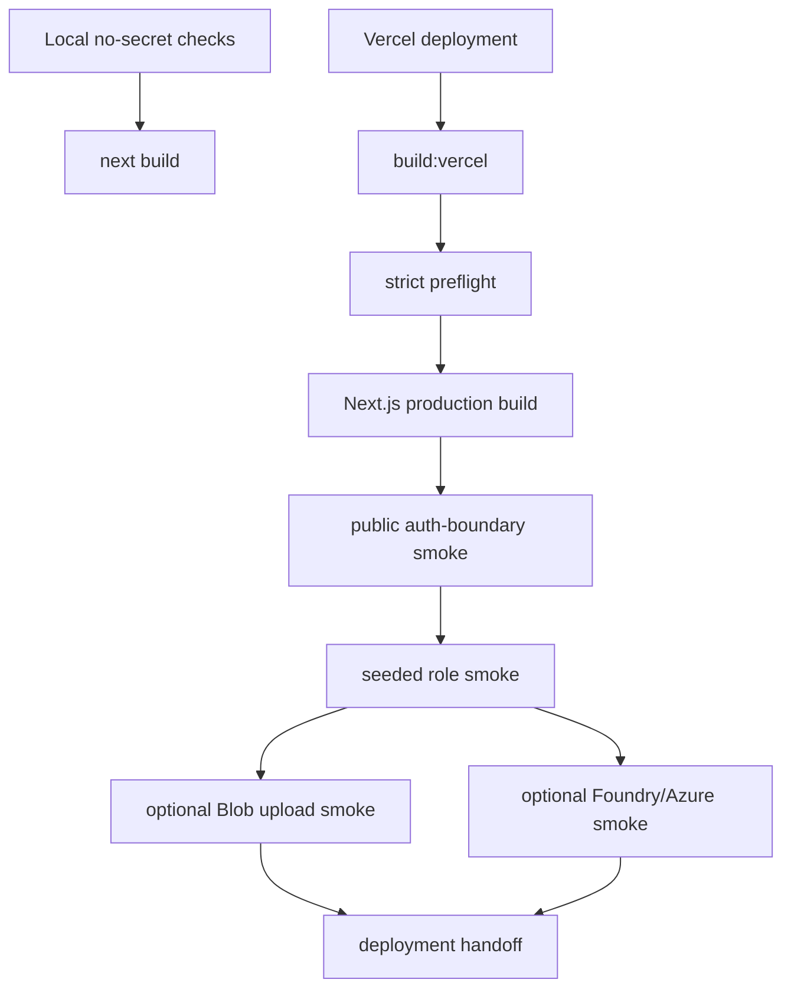
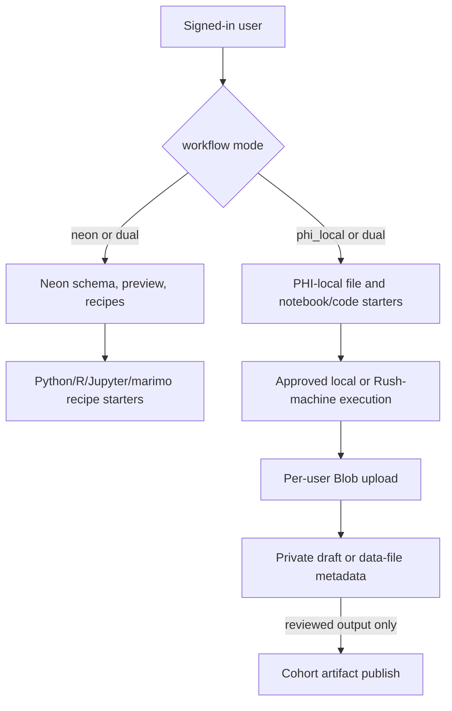

# Runtime deployment readiness

## Summary

Finish the deployability proof for the Summer Intern Portal after the core MVP surfaces have been implemented. The work keeps the native Next.js/Vercel chat frontend, server-side Foundry/Azure routing, Neon-vs-PHI-local intern split, Compound Engineering workflow guidance, and per-user Azure Blob upload model intact while making the remaining smoke-test and handoff path explicit.

---

## Problem Frame

The portal now has code for fixed-user auth, server-side model routing, query preview, dataset recipes, PHI-local starter code, CE workspace documents, admin usage, and per-user Blob-backed files. The remaining risk is that the repo can look locally green while the actual intern deployment is not proven with seeded users, real Vercel env values, live Neon roles, live Blob ownership metadata, and optional Foundry calls. This plan targets that proof layer rather than adding a new user-facing feature.

---

## Requirements

### Deployment Gate

- R1. Vercel deployments must run strict preflight before the Next.js production build so missing Foundry/Azure, Neon, Blob, account, budget, and workflow-mode settings fail before intern access.
- R2. Local verification must retain a no-secret build path so coding agents can keep checking TypeScript and Next.js output without production secrets.
- R3. Deployment docs must tell the operator exactly which strict and missing-secret checks to run, and what remains unverified until live smoke credentials exist.
- R4. The loaded static teaching database size must be checked against the selected Neon plan before interns receive access.

### Runtime Smoke Proof

- R5. Runtime smoke must cover the Neon-enabled intern, PHI-local intern, and admin roles with seeded credentials.
- R6. Runtime smoke must distinguish credential-free public auth-boundary checks from seeded login/API checks.
- R7. Optional smoke modes must verify per-user Blob upload isolation and server-side Foundry/Azure calls without printing passwords, cookies, SAS URLs, Blob paths, API keys, or connection strings.

### Intern Workflow Contract

- R8. Neon-enabled interns must be able to use schema, ward, SELECT-only preview, saved recipe, and recipe-to-code starter workflows without receiving database owner credentials.
- R9. PHI-local interns must be blocked from Neon schema/query workflows and guided toward local or approved Rush-machine Python, R, Jupyter, and marimo code.
- R10. Interns must not manage model names, route tiers, Foundry keys, Neon URLs, or Blob paths; the portal and local CE guidance must keep those concerns server-side or admin-owned.

### File and Artifact Safety

- R11. All uploaded files must remain under generated per-user Blob namespaces and metadata rows, with private data/notebook/source records kept separate from publishable HTML, Word, and PowerPoint artifacts.
- R12. Publish/open flows must verify owner/admin/cohort access and Blob owner metadata before content is streamed or shared.
- R13. Generated starter code and artifact guidance must avoid exposing row-level PHI by default and must steer shared outputs toward aggregate-safe review.

---

## Key Technical Decisions

- KTD1. Keep `npm run build` as local Next-only verification, and use `npm run build:vercel` for deployed builds. This preserves fast local checks while forcing Vercel through strict preflight by repo configuration.
- KTD2. Treat seeded runtime smoke as the next proof gate, not as an optional polish step. The app is not deployment-ready until a Neon intern, PHI-local intern, and admin can complete the scripted checks with real seeded credentials.
- KTD3. Keep CE workflow enablement inside the portal and student guide, not in model-routing UI. Interns should use the Compound Engineering plugin and portal launchers, while Foundry routing remains automatic.
- KTD4. Preserve the workflow split as an authorization boundary. UI affordances are helpful, but server routes must remain the source of truth for Neon access, PHI-local file workflows, and admin visibility.
- KTD5. Use short-lived, least-privilege Blob SAS only for upload targets, then verify Azure Blob metadata server-side before completing metadata or publishing artifacts. This follows Microsoft guidance that SAS access should be granular, time-bounded, and validated after upload.

---

## High-Level Technical Design

---

## Implementation Units

### U1. Deployment build gate verification

**Goal:** Ensure repo-level deployment configuration forces strict preflight before Vercel builds while preserving local no-secret build verification.

**Requirements:** R1, R2, R3

**Dependencies:** none

**Files:**

- `package.json`
- `vercel.json`
- `tools/local_invariants.mjs`
- `README.md`
- `docs/runbooks/deployment.md`

**Approach:** Keep the local `build` script as plain Next.js output, add a separate deployment build script that runs preflight first, and pin the Vercel build command in versioned config. Extend local invariants so removing the deployment preflight gate fails immediately.

**Patterns to follow:** Existing preflight and invariant checks in `tools/preflight_check.mjs` and `tools/local_invariants.mjs`.

**Test scenarios:**

- Happy path: Local invariants parse `package.json` and `vercel.json`, then confirm Vercel uses the strict deployment build script.
- Edge case: Local build remains usable without real production secrets.
- Error path: A future change that points Vercel back to plain `next build` fails local invariants.

**Verification:** Local invariants, TypeScript, missing-secret preflight, and Next.js build all pass.

### U2. Seeded runtime smoke readiness

**Goal:** Make the full runtime smoke path actionable for real deployment by checking the seeded credential contract and documenting the exact role coverage.

**Requirements:** R5, R6, R7, R8, R9

**Dependencies:** U1

**Files:**

- `tools/runtime_smoke.mjs`
- `tools/generate_intern_users.mjs`
- `tools/seed_neon_users.mjs`
- `README.md`
- `docs/runbooks/deployment.md`

**Approach:** Keep runtime smoke fail-fast when seeded credentials are missing, but ensure the error lists all missing variables and points to the generator and seed workflow. Confirm smoke coverage includes the public auth-boundary pass, Neon intern login, PHI-local Neon blocking, admin usage visibility, and optional upload/chat passes.

**Patterns to follow:** Existing runtime smoke credential reporting and public smoke mode.

**Test scenarios:**

- Happy path: With seeded credentials, smoke verifies login and workflow mode for Neon, PHI-local, and admin accounts.
- Edge case: With no seeded credentials, smoke fails before login and reports every missing `SMOKE_*` value.
- Error path: A PHI-local smoke account cannot access Neon schema, query preview, or saved recipes.
- Integration scenario: Admin smoke can see usage metadata created by intern smoke activity.

**Verification:** Runtime smoke either passes with live seeded credentials or fails only at the explicit missing-credential gate.

### U3. Live service handoff checks

**Goal:** Close the remaining operator handoff gaps for live Neon, Azure Blob, Foundry/Azure, and Vercel environment setup.

**Requirements:** R1, R3, R4, R7, R11, R12

**Dependencies:** U1, U2

**Files:**

- `.env.example`
- `docs/runbooks/deployment.md`
- `docs/security/security-model.md`
- `tools/preflight_check.mjs`
- `tools/neon_healthmap_sync.py`

**Approach:** Keep strict preflight as configuration shape validation, and keep live proof in runtime smoke plus Neon verification. The handoff should make clear that the loaded teaching copy fits the selected Neon plan or has an approved paid/curated path, `READONLY_DATABASE_URL` must use an approved reader role, Blob CORS must include the final Vercel origin, and Foundry/Azure route names/prices must match the actual deployment.

**Patterns to follow:** Existing separation between `DATABASE_URL`, `READONLY_DATABASE_URL`, strict preflight, and `db:verify-neon`.

**Test scenarios:**

- Happy path: Preflight accepts an app owner metadata URL plus a distinct read-only URL whose username is reader-shaped.
- Edge case: Missing-secret preflight remains useful for local agents and docs-only checks.
- Error path: Preflight rejects likely owner/admin/write/service usernames in `READONLY_DATABASE_URL`.
- Integration scenario: Neon verification confirms the read-only role cannot write before intern access.
- Integration scenario: Database restore/verification records whether the loaded static copy fits the selected Neon plan before intern access.

**Verification:** Preflight and Neon verification give distinct, non-overlapping evidence: configuration shape first, live database permissions second.

### U4. Workflow and file-boundary regression coverage

**Goal:** Keep the intern workflow split and per-user file boundary from regressing while the deployment proof is completed.

**Requirements:** R8, R9, R10, R11, R12, R13

**Dependencies:** U2

**Files:**

- `app/api/schema/route.ts`
- `app/api/wards/route.ts`
- `app/api/query-preview/route.ts`
- `app/api/dataset-recipes/route.ts`
- `app/api/files/upload-url/route.ts`
- `app/api/files/complete/route.ts`
- `app/api/files/open/route.ts`
- `app/api/artifacts/route.ts`
- `app/api/artifacts/open/route.ts`
- `app/api/artifacts/generated/route.ts`
- `components/chat/shell.tsx`
- `app/lib/azure-upload.ts`
- `app/lib/dataset-recipes.ts`
- `app/lib/sql-preview.ts`
- `tools/local_invariants.mjs`
- `tools/runtime_smoke.mjs`

**Approach:** Treat route-level auth, workflow-mode guards, Blob owner metadata, private-data artifact separation, and starter-code PHI minimization as one regression surface. Add or tighten invariant and smoke checks only where existing tests do not prove the behavior.

**Patterns to follow:** Existing route guards, `assertAzureBlobOwner`, starter-code builders, and no-store/same-origin invariants.

**Test scenarios:**

- Happy path: Neon intern can save a SELECT-only recipe and generate Python, R, Jupyter, and marimo starters without receiving secrets.
- Happy path: PHI-local intern can upload allowed data/notebook/source files and receive local starter code.
- Edge case: Uploaded private data files cannot be repurposed through artifact publish routes.
- Error path: Cross-intern file list/open attempts are blocked.
- Error path: Generated HTML containing direct identifiers or row-level tables is rejected before storage or publish.
- Integration scenario: Blob upload completion verifies Azure-controlled metadata and owner path before metadata persistence.

**Verification:** Local invariants and optional upload smoke cover workflow boundaries and Blob isolation.

### U5. Final deployment report

**Goal:** Leave a concise readiness record that distinguishes what is proven locally, what is proven live, and what still requires operator action.

**Requirements:** R3, R5, R7

**Dependencies:** U1, U2, U3, U4

**Files:**

- `docs/audits/`
- `README.md`
- `docs/runbooks/deployment.md`

**Approach:** If live seeded credentials or service env vars are unavailable, record that as an explicit readiness gap rather than calling the goal complete. If live smoke passes, record the date, target URL, smoke modes used, and any operator-only follow-up such as Azure CORS origin or retention policy confirmation.

**Patterns to follow:** Existing audit documents in `docs/audits/`.

**Test scenarios:** Test expectation: none -- this is a documentation and handoff unit.

**Verification:** The audit lets an admin see which proof gates passed and which are blocked by missing live configuration.

---

## Scope Boundaries

Included:

- Deployment preflight/build gating.
- Runtime smoke and seeded credential readiness.
- Live-service handoff checks for Vercel, Neon, Foundry/Azure, and Azure Blob.
- Regression coverage for workflow-mode authorization and per-user Blob isolation.

Deferred to Follow-Up Work:

- Formal Vercel project creation if credentials or ownership are not available in this repo session.
- Actual Azure Storage CORS editing, lifecycle policy creation, and budget alert configuration when Azure console/API access is not available.
- Rotating real intern passwords after handoff.
- Formal HIPAA, SOC2, procurement, or legal attestation.

Outside this product's identity:

- Browser-based arbitrary Python/R execution.
- Intern-managed model routing, Foundry API keys, Neon owner URLs, or Blob paths.
- Public signup or unmanaged account creation.

---

## System-Wide Impact

This plan affects deployment confidence rather than product shape. The main cross-system contract is that local code gates, Vercel build configuration, Neon role verification, Azure Blob metadata checks, and runtime smoke all prove different pieces of the same safety model. The portal remains a server-routed assistant and workflow coach, not a cloud IDE.

---

## Risks and Dependencies

- Live seeded smoke requires real seeded credentials for one Neon-enabled intern, one PHI-local intern, and one admin. Without those, runtime smoke can only prove the public auth-boundary and missing-credential gate.
- Blob upload smoke requires Azure Storage env vars and CORS that allow the tested app origin.
- Foundry/Azure chat smoke consumes a small model call and depends on valid route names, API version, endpoint, and key.
- Neon Free viability remains dependent on actual loaded database size and compute/egress behavior after import.
- The current worktree is broadly dirty, so the implementer must avoid reverting unrelated edits and should stage only intended files.

---

## Documentation / Operational Notes

The deployment runbook should keep three proof tiers separate:

- Local proof: invariants, TypeScript, missing-secret preflight, and Next.js build.
- Public deployed proof: credential-free smoke against the Vercel URL.
- Seeded deployed proof: role-specific smoke with Neon, PHI-local, admin, optional Blob, and optional Foundry/Azure checks.

---

## Sources / Research

- `docs/brainstorms/summer-intern-portal-requirements.md`
- `docs/architecture/free-tier-tech-stack-research.md`
- `docs/architecture/system-architecture.md`
- `docs/security/security-model.md`
- `docs/plans/2026-06-25-001-feat-azure-blob-auth-deployment-plan.md`
- `docs/audits/2026-06-25-claude-goals-readiness-audit.md`
- Vercel Project Configuration docs: `vercel.json` can override the project build command with `buildCommand`.
- Vercel Configure a Build docs: Next.js defaults to the package `build` script unless overridden.
- Microsoft Azure Storage SAS overview: SAS grants delegated access with granular permissions and validity duration.
